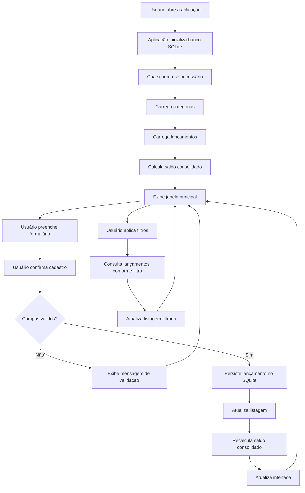

# FLOW.md — Fluxo do Sistema

## Diagrama Mermaid

## Leitura do fluxo em três movimentos

### Movimento 1 — Inicialização

Quando o usuário abre o aplicativo, o sistema garante a existência da estrutura
do banco SQLite (cria se necessário), carrega as categorias disponíveis, carrega
os lançamentos já gravados, calcula o saldo atual e abre a janela principal.
Isso garante que o programa já se apresente em estado útil desde o primeiro segundo.

### Movimento 2 — Cadastro de lançamento

O usuário preenche o formulário com tipo, valor, categoria, data e descrição
opcional. Ao confirmar, o sistema valida os dados. Se houver erro, a operação é
interrompida e o usuário recebe uma mensagem explicativa. Se os dados estiverem
corretos, o lançamento é gravado, a listagem é atualizada, o saldo é recalculado
e a interface reflete o novo estado.

### Movimento 3 — Consulta com filtros

A qualquer momento, o usuário pode aplicar filtros por período, categoria ou tipo.
O sistema consulta os lançamentos de acordo com os critérios informados e atualiza
a listagem exibida, sem alterar nenhum dado gravado.

## O que o fluxo revela

O passo **"Cria schema se necessário"** implica que o sistema precisa verificar
se o banco já existe antes de tentar criar as tabelas. O usuário não deve precisar
rodar scripts manuais para preparar o banco. O programa cuida disso sozinho.
